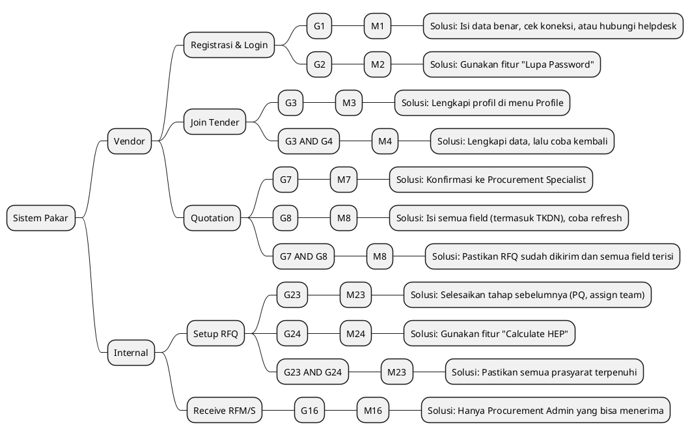

```plantuml
@startmindmap
skinparam {
    defaultFontName "Times New Roman"
    mindmapDiagram {
        node {
            FontName "Times New Roman"
        }
    }
}
* Sistem Pakar

** Vendor
*** Registrasi & Login
**** G1
***** M1
****** Solusi: Isi data benar, cek koneksi, atau hubungi helpdesk
**** G2
***** M2
****** Solusi: Gunakan fitur "Lupa Password"

*** Join Tender
**** G3
***** M3
****** Solusi: Lengkapi profil di menu Profile
**** G3 AND G4
***** M4
****** Solusi: Lengkapi data, lalu coba kembali

*** Quotation
**** G7
***** M7
****** Solusi: Konfirmasi ke Procurement Specialist
**** G8
***** M8
****** Solusi: Isi semua field (termasuk TKDN), coba refresh
**** G7 AND G8
***** M8
****** Solusi: Pastikan RFQ sudah dikirim dan semua field terisi

** Internal
*** Setup RFQ
**** G23
***** M23
****** Solusi: Selesaikan tahap sebelumnya (PQ, assign team)
**** G24
***** M24
****** Solusi: Gunakan fitur "Calculate HEP"
**** G23 AND G24
***** M23
****** Solusi: Pastikan semua prasyarat terpenuhi

*** Receive RFM/S
**** G16
***** M16
****** Solusi: Hanya Procurement Admin yang bisa menerima

@endmindmap
```
